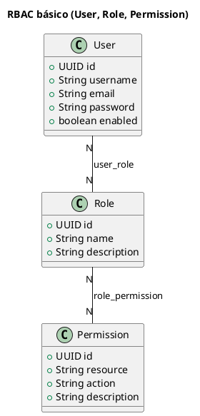

# chamados

## Descricao do projeto

Aplicacao web de chamados para condominio, com interface server-side em JSP e layout AdminLTE. O sistema organiza a operacao entre moradores, colaboradores e administradores, cobrindo abertura e acompanhamento de chamados, comentarios, anexos, gestao de usuarios, escopo por lotacao/tipo e auditoria de alteracoes.

O front-end segue padrao de componentes em `src/main/resources/static` (Bootstrap 5, AdminLTE, jQuery e DataTables) e views em `src/main/webapp/WEB-INF/jsp`, com navegacao e telas orientadas por perfil.

## Decisoes tecnicas por modulo

### 1. Autenticacao e autorizacao

O modulo de autenticacao e autorizacao foi implementado com **Spring Security** usando login por formulario, sessao HTTP e `remember-me`, com politicas de acesso por papel e permissao.

**O que foi usado**

- `SecurityFilterChain` com rotas publicas restritas a login/assets e autenticacao obrigatoria para o restante.
- `CustomUserDetailsService` + `UserPrincipal` para carregar usuario do banco e montar authorities de role e permissao.
- `BCryptPasswordEncoder` para hash de senha.
- Modelo RBAC persistido com `roles`, `permissions`, `user_role` e `role_permission`.
- Protecao adicional de login com rate limit

**Referencia de RBAC no codigo**

- Exemplo por papel: `@PreAuthorize("isAuthenticated() and hasRole('ADMIN')")` em.
- Exemplo papel + permissao: expressoes `hasAuthority(...)` e `hasAnyRole(...)`.
- Catalogo de permissoes no padrao `RESOURCE:ACTION`.

**Por que essa decisao**

- RBAC atende diretamente ao dominio do condominio, que tem responsabilidades bem definidas entre `ADMIN`, `COLABORADOR` e `MORADOR`.
- A combinacao **role + permissao** permite regra global por perfil e ajuste fino por capacidade sem acoplamento de regra no front.
- Spring Security reduz codigo customizado de seguranca e mantem o controle de acesso declarativo, rastreavel e testavel.

### 2. Blocos e moradias

Esse modulo modela a estrutura do condominio em cadeia (`Bloco` -> `Andar` -> `Unidade`) e separa a ocupacao em uma entidade propria: **`Moradia`**.

`Moradia` representa a relacao entre **usuario** e **unidade** ao longo do tempo. Essa decisao evita perder historico de ocupacao quando um morador sai, troca ou encerra vinculo com a unidade.

A modelagem tambem separa estados com objetivos diferentes:

- **Status da unidade**: descreve a condicao operacional da unidade no condominio.
- **Status da moradia**: descreve a situacao do vinculo do morador com a unidade (ex.: ativa, encerrada, transferida).

Essa separacao foi adotada para nao misturar estado fisico do patrimonio com estado de ocupacao por pessoa, o que melhora consistencia das regras e consultas.

Um ponto critico de consistencia e a criacao de bloco completo: o sistema cria bloco, andares e unidades dentro de uma unica transacao. Se qualquer etapa falhar, tudo e revertido, impedindo cadastro parcial da estrutura.

### 3. Chamados

O modulo de chamados foi desenhado para separar claramente **quem solicita**, **quem atende** e **como o fluxo evolui**.

Na modelagem, o chamado nao e apenas um registro textual. Ele conecta:

- unidade (onde o problema acontece),
- tipo de chamado (natureza do atendimento),
- status atual (ponto no fluxo),
- solicitante (quem abriu),
- colaborador responsavel (quem esta atendendo).

Essa separacao de papeis (solicitante x responsavel) foi uma decisao central para evitar ambiguidade no atendimento e permitir regras diferentes para morador e equipe.

Outra decisao importante foi tornar o fluxo de status orientado por **State**:

- cada status possui um `comportamento_tipo` (`INICIAL`, `INTERMEDIARIO`, `FINAL`);
- cada status pode definir seus proximos status permitidos;
- a transicao e validada pelo comportamento do estado atual.

O motivo dessa escolha foi tirar regra de transicao de `if/else` espalhado no servico e transformar o fluxo em uma regra de dominio explicita e configuravel.

Na abertura do chamado, o status inicial e automatico: o `TipoChamado` tem seu `status_inicial` proprio. Assim, o create nao depende de escolha manual de status e cada tipo ja nasce no ponto correto do fluxo.

Sobre escopo de atendimento, a arquitetura adotou **lotacao como unidade de capacidade operacional**:

- a lotacao define quais tipos de chamado ela atende;
- o usuario colaborador e vinculado a uma ou mais lotacoes;
- com isso, o que ele pode ver/assumir vem do cruzamento `usuario -> lotacao -> tipos de chamado`.

Essa abordagem foi escolhida para representar o time de atendimento de forma real (ex.: eletrica, hidraulica, portaria), sem acoplar o escopo diretamente no usuario de forma rigida.

No banco, isso fica materializado por tabelas de relacao (`lotacao_tipo_chamado` e `user_lotacao`), mantendo flexibilidade para remanejamento de equipe sem remodelar chamados ja existentes.

Tambem foi mantido o historico conversacional do chamado com comentarios e anexos em entidades proprias, para preservar contexto de atendimento e evidencias sem inflar a entidade principal.

Em arquitetura da solucao, as regras ficam concentradas na camada de servico, enquanto controllers cuidam do fluxo MVC e repositories aplicam consultas com escopo. Operacoes criticas de criacao/atualizacao rodam em transacao para manter consistencia entre chamado, status e anexos.

## O que foi configurado

- Perfis de configuracao (`dev` e `prod`) com variaveis de ambiente.
- `docker-compose.yml` com servicos `app` e `db`.
- `Dockerfile` para containerizar a aplicacao Spring Boot.
- Build Docker com cache de Maven e imagens Alpine mais leves.
- Arquivo `.env` para credenciais e configuracoes de ambiente local.
- Documentação de erros MVC em `docs/error-handling-mvc.md`.
- Setup de JSP com JSTL e Bootstrap 5 via WebJars.


## Subir tudo com Docker Compose

```powershell
docker compose up --build
```

A aplicacao fica em `http://localhost:8080` e o banco em `localhost:5432`.


### Bootstrap automatico de dados no `docker compose up`

No `up`, o servico `db-bootstrap` executa automaticamente:

1. `src/main/resources/db/seed/auth_bootstrap.sql`
2. `src/main/resources/db/seed/dev_bootstrap.sql`

Esses scripts sao idempotentes (podem rodar em todo `up` sem duplicar dados essenciais).

**Credenciais de desenvolvimento criadas pelos scripts**

| Role | Username (login) | Senha |
| --- | --- | --- |
| ADMIN | `admin` | `admin123` |
| COLABORADOR | `colab.manutencao` | `dev123` |
| COLABORADOR | `colab.portaria` | `dev123` |
| MORADOR | `morador.101` | `dev123` |
| MORADOR | `morador.102` | `dev123` |

## Testes

O projeto inclui uma suíte de testes automatizada que cobre unidades, camadas MVC e integrações. As principais bibliotecas utilizadas são:

- `spring-boot-starter-test` (JUnit 5, AssertJ, Mockito e suporte do Spring Test)
- `spring-security-test` (helpers para testes de segurança)
- `testcontainers` (suporte a containers para testes de integração com Postgres)
- H2 (banco em memória para testes rápidos)

Os relatórios de execução ficam em `target/surefire-reports/`.

Armazenamento de anexos e imagens
---------------------------------

Os arquivos enviados pela aplicação (imagens, PDFs e outros anexos) são armazenados em disco no diretório `uploads/` na raiz do projeto durante o desenvolvimento (veja a pasta `uploads/` no repositório). Para evitar colisões e facilitar o gerenciamento, os arquivos são gravados com nomes baseados em UUID; o nome original, tipo MIME, tamanho, dono e vínculo (por exemplo: `Chamado`, `Comentario`, `Usuario`) são persistidos no banco de dados como metadados e referenciam o arquivo físico.

Em produção o caminho de armazenamento é configurável via propriedades da aplicação (`application-*.properties`) — a configuração padrão de desenvolvimento usa a pasta local `uploads/`. O acesso aos anexos é controlado pela camada de aplicação (controllers/serviços) para garantir autorização (RBAC) e não expor diretamente arquivos sensíveis sem checagem.

No Docker Compose, o armazenamento de arquivos funciona assim:

- A aplicação usa `APP_UPLOADS_DIR=/app/uploads`.
- O serviço `app` monta o volume nomeado `chamados_uploads_data` em `/app/uploads`.
- Resultado: imagens de perfil e anexos (`user_fotos`, `chamado_anexos`, `comentario_anexos`) continuam salvos mesmo após recriar o container da aplicação.
- Para limpar os arquivos persistidos, remova o volume (`docker volume rm chamados_chamados_uploads_data`) ou rode `docker compose down -v`.

Usuários e perfis
-----------------

O modelo de segurança do projeto implementa RBAC (roles + permissions). Resumidamente:

- Usuários (`User`) são associados a um ou mais perfis/papéis (roles) através de uma relação (tabela de junção `user_role`).
- Cada papel (`Role`) pode agregar várias permissões (`Permission`) — há uma relação `role_permission` que permite mapear capacidades finas além do papel.
- No código, essas roles e permissions são convertidas em authorities usadas pelo Spring Security para controlar acesso a rotas e ações (anotações como `@PreAuthorize` e expressões `hasAuthority(...)` / `hasRole(...)`).

Essa modelagem permite regras globais por papel (ex.: `ADMIN`, `COLABORADOR`, `MORADOR`) e ajustes finos por permissão quando necessário.

O diagrama abaixo resume essa modelagem RBAC básica:



.\mvnw.cmd -Dtest=NomeDaClasseDeTeste test
# ou um método específico
.\mvnw.cmd -Dtest=NomeDaClasseDeTeste#metodoDeveFazerAlgo test
```

Testcontainers e Docker

Alguns testes de integração usam Testcontainers para criar um banco Postgres isolado. Para esses testes funcionarem corretamente você precisa ter o Docker em execução na máquina. Caso não queira (ou não possa) rodar Docker localmente, existem opções:

- Executar apenas os testes rápidos que usam H2 (filtrar por pacotes/nomes de testes com `-Dtest=`).
- Configurar uma profile ou variável de ambiente no projeto para desabilitar testes que usam Testcontainers (se implementado). Neste repositório há dependências de Testcontainers, por isso tenha Docker ativo para executar todas as suítes.

Boas práticas e convenções de teste usadas no projeto

- Testes de unidade usam JUnit 5 e Mockito para mocks e asserts com AssertJ.
- Testes de camada Spring usam anotações do Spring Test:
  - `@SpringBootTest` para testes de integração que inicializam o contexto completo;
  - `@AutoConfigureMockMvc` + `MockMvc` para testar controllers sem abrir servidor HTTP;
  - `@DataJpaTest` para testes focados em repositórios com um banco em memória;
  - `@WebMvcTest` para testar controllers isolados com mocks dos beans dependentes.
- Para testar segurança e endpoints autenticados, usamos `spring-security-test` com `@WithMockUser` ou `SecurityMockMvcRequestPostProcessors`.
- Testes de integração que dependem do Postgres usam `@Testcontainers` e containers declarados com `@Container` (Testcontainers + JUnit Jupiter).

Onde achar relatórios e saídas

- Resultados do Surefire estão em `target/surefire-reports/` (logs e stacks de falha de cada teste).
